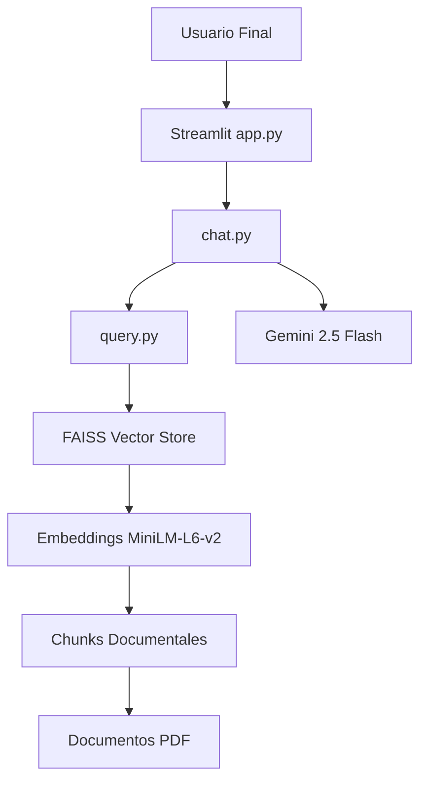
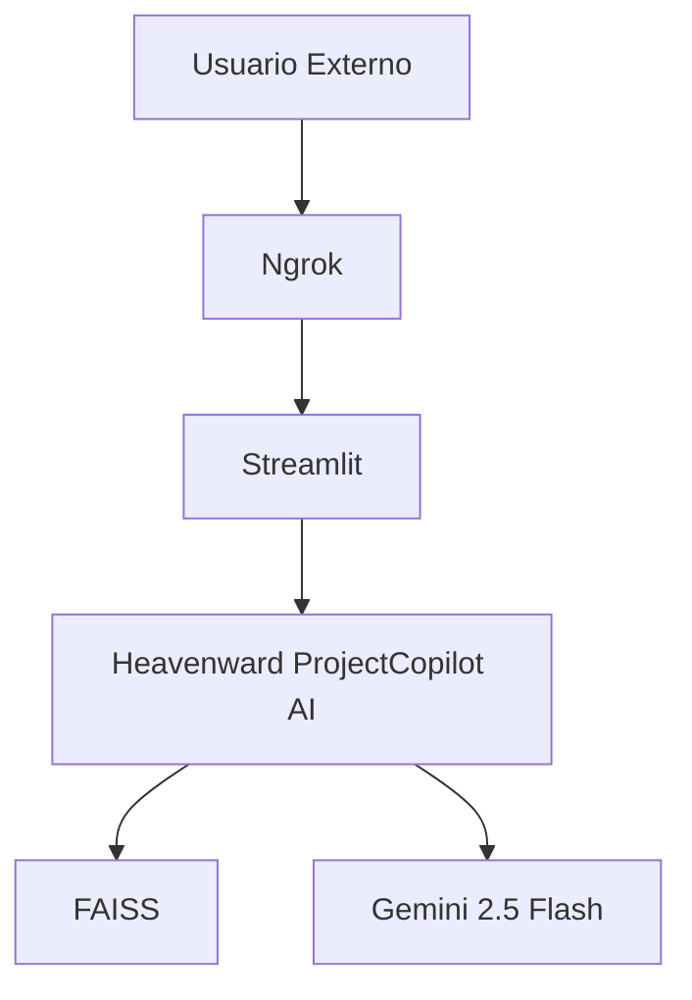
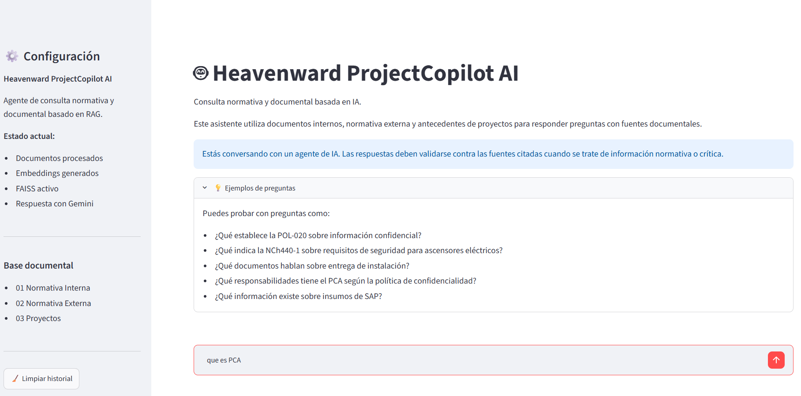
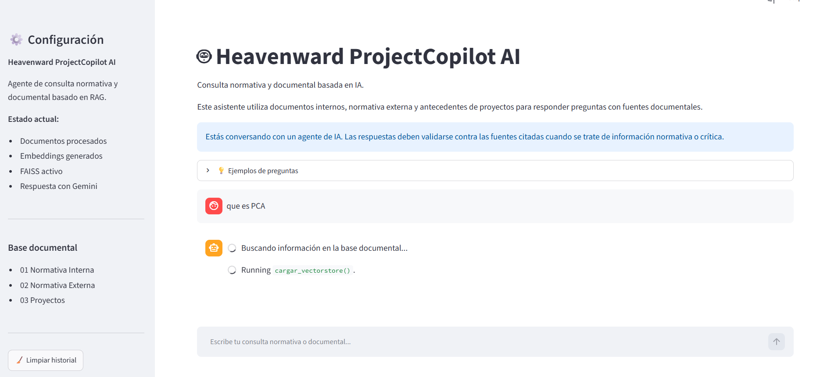
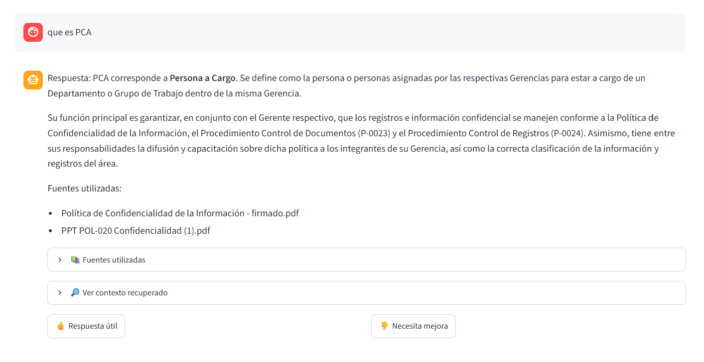

# Heavenward ProjectCopilot AI

## Resumen Ejecutivo

Heavenward ProjectCopilot AI es un agente RAG (Retrieval Augmented Generation)
desarrollado para responder consultas sobre normativa interna, normativa externa
y documentación de proyectos de Heavenward Ascensores S.A.

## Objetivos

- Centralizar conocimiento documental.
- Reducir tiempos de búsqueda.
- Entregar respuestas con fuentes verificables.
- Minimizar alucinaciones mediante recuperación documental.

## Arquitectura General

## Tecnologías utilizadas

- Python
- Streamlit
- LangChain
- FAISS
- Sentence Transformers
- Gemini 2.5 Flash
- Docker
- GitHub

## Flujo del Sistema

Función de cada componente
* ingest.py: Extrae texto desde PDF
* cleaning.py: Limpia y normaliza contenido
* chunking.py: Divide texto en fragmentos
* embeddings.py: Genera vectores semánticos
* FAISS: Almacena y busca embeddings

## 1. Ingesta documental

src/ingest.py

- Lectura de PDFs
- Extracción de texto

## 2. Limpieza

src/cleaning.py

- Normalización del texto
- Eliminación de caracteres no deseados

## 3. Chunking

src/chunking.py

Configuración:

- CHUNK_SIZE = 2500
- CHUNK_OVERLAP = 300

## 4. Embeddings

src/embeddings.py

Modelo:

sentence-transformers/all-MiniLM-L6-v2

## 5. Vector Store

FAISS

Archivos:

- vectorstore/index.faiss
- vectorstore/index.pkl

## 6. Recuperación Semántica

src/query.py

Pregunta
↓
Embeddings
↓
FAISS
↓
Top K resultados

## 7. Generación de Respuestas

src/chat.py

Pregunta
↓
Contexto
↓
Gemini
↓
Respuesta

## 8. Interfaz

app.py

Funcionalidades:

- Chat conversacional
- Historial
- Fuentes documentales
- Feedback
- Auditoría de contexto

## 9. Dockerización

Dockerfile validado exitosamente.

Comandos principales:

docker build -t heavenward-projectcopilot-ai .

docker run -p 8501:8501 --env-file .env heavenward-projectcopilot-ai

## 10. Publicación y Acceso Público

### Publicación temporal para demostración

Con el objetivo de permitir la validación externa del sistema por parte de evaluadores y usuarios, la aplicación fue publicada temporalmente mediante Ngrok.

### URL Pública de Demostración

> https://prune-clumsy-outrank.ngrok-free.dev

### Arquitectura de Publicación

### Beneficios

- Acceso remoto sin necesidad de instalación.
- Validación externa del sistema.
- Demostración funcional del agente IA.
- Acceso mediante navegador web.

## Evidencias

### Interfaz principal del agente

La siguiente imagen muestra la interfaz principal de Heavenward ProjectCopilot AI desarrollada en Streamlit.  
La aplicación permite consultar normativa interna, normativa externa y documentación de proyectos mediante una interfaz conversacional.

---

### Recuperación semántica

La siguiente imagen muestra el proceso de consulta realizado por el usuario.  
El sistema busca información en la base documental, recupera fragmentos relevantes desde FAISS y prepara el contexto para la generación de la respuesta.

---

### Generación de respuesta

La siguiente imagen muestra una respuesta generada por el agente utilizando Retrieval Augmented Generation y Gemini.  
La respuesta incluye información contextual, fuentes documentales utilizadas y opciones de auditoría del contexto recuperado.

## Arquitectura OCI Objetivo

GitHub
↓
OCI Compute
↓
Docker
↓
Streamlit
↓
Usuarios

Servicios OCI considerados:

- OCI Compute
- OCI Object Storage
- OCI Vault
- OCI DevOps

## Estado del Proyecto

✅ Colecta documental

✅ Extracción

✅ Chunking

✅ Embeddings

✅ FAISS

✅ Recuperación RAG

✅ Generación de respuestas

✅ Streamlit

✅ Docker

✅ URL Pública mediante Ngrok

✅ OCI Compute

✅ MVP Funcional

## Conclusiones

Heavenward ProjectCopilot AI implementa una arquitectura RAG completa, desde la extracción documental hasta la generación de respuestas mediante inteligencia artificial generativa.

La solución integra:

- Procesamiento documental.
- Recuperación semántica mediante FAISS.
- Generación de respuestas con Gemini 2.5 Flash.
- Interfaz web desarrollada en Streamlit.
- Contenerización mediante Docker.
- Publicación pública mediante Ngrok.
- Preparación para despliegue en Oracle Cloud Infrastructure.

El resultado corresponde a un MVP funcional y demostrable capaz de entregar respuestas fundamentadas utilizando documentación corporativa verificable.
documentación corporativa, recuperar contexto relevante y generar
respuestas fundamentadas utilizando Gemini.
